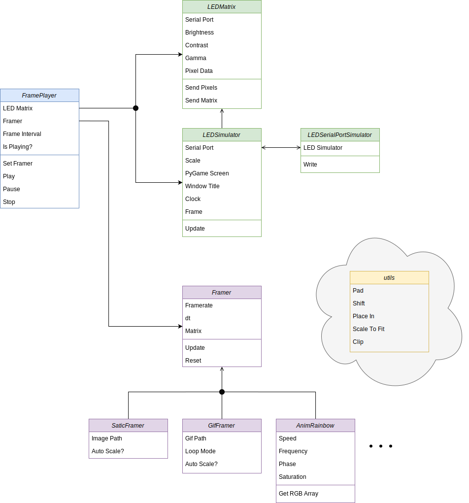
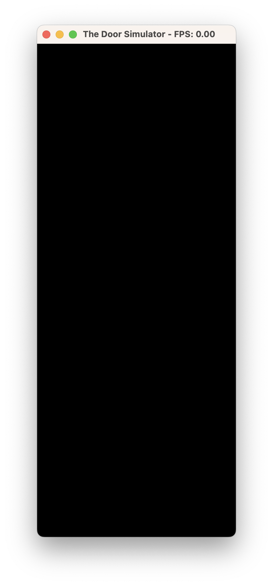
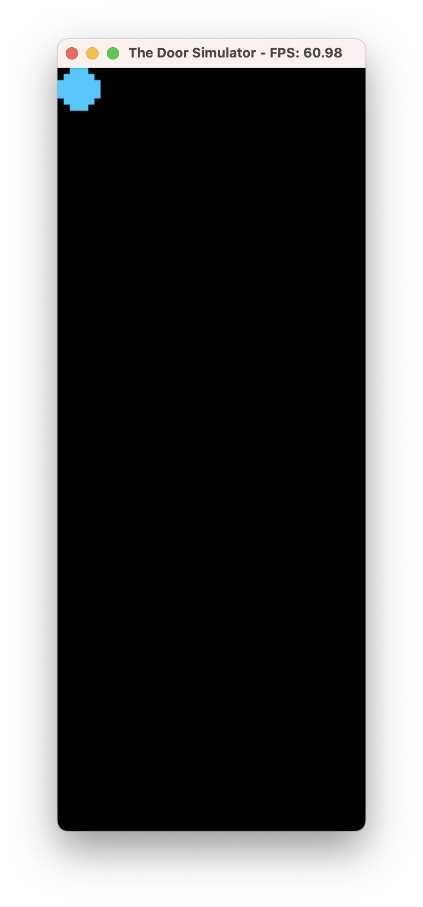
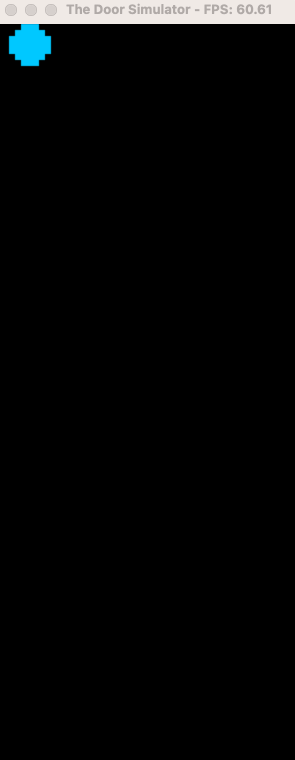

### Table of Contents
- [Overview](#overview)
- [*ledmat*](#ledmat)
    - [TODO](#todo)
- [*framing*](#framing)
  - [`FramePlayer`](#frameplayer)
  - [`Framer`](#framer)
  - [Making A Framer](#making-a-framer)
    - [Testing a `Framer`](#testing-a-framer)
    - [Example](#example)
      - [Step 1: Create the Framer File](#step-1-create-the-framer-file)
      - [Step 2: Create the testing script](#step-2-create-the-testing-script)
      - [Step 3: Generating frames](#step-3-generating-frames)
      - [Step 4: Moving the ball](#step-4-moving-the-ball)
      - [Step 5: Improving the animation](#step-5-improving-the-animation)
   
# Overview
This folder contains the source code for the generation side of the LED Door Matrix. There are two modules:
* *ledmat*
* *framing*
  
The *ledmat* module contains the `LEDMatrix` and `LEDSimulator` code for communicating with the LED Matrix (driven by a Teensy 4) or simulating the LED Matrix for testing. The *framing* module contains the `FramePlayer` and `Framer` classes for generating frames to be displayed on the LED Matrix. It also holds the *utils* modules with useful tools for manipulating frames. The following diagram shows the relationship between the these modules.



# *ledmat*
This module contains the `LEDMatrix` and `LEDSimulator` classes for communicating with the LED Matrix (driven by a Teensy 4) or simulating the LED Matrix for testing. The `LEDMatrix` class is a wrapper around the `serial` module for sending data to the Teensy 4. The `LEDSimulator` class is a wrapper around the `pygame` module for simulating the LED Matrix for testing. 

The `LEDMatrix` class provides functions for sending matrix data to the LED Matrix. A 3D (Height, Width, Channel) numpy array can be given to the class and it gets color corrected for the matrix and serialized into a byte stream for the Teensy to handle.

The `LEDSimulator` class provides functions for simulating the LED Matrix. This class inherits from the `LEDMatrix` class and provides an identical interface to `LEDMatrix` to simulate the full functionality of the LED Matrix. Currently, the simulator needs to be updated at regular intervals to manage the window and handle events. 

### TODO
* Migrate LEDSimulator to main GUI Framework (PyQt6?)

# *framing*
This module contains the `FramePlayer` and `Framer` classes for generating frames to be displayed on the LED Matrix. It also holds the *utils* modules with useful tools for manipulating frames. 

## `FramePlayer`
The `FramePlayer` class has three ways to play frames:
* play-update: The caller is responsible for calling `play()` to start the frame and then call `update()` as often as possible.
* play-async: The caller is responsible for setting of the async environment and calling `play_async()`.
* play-blocking: The caller calls `play_blocking()` and the function blocks until the frames are done playing. Note that frames are not guaranteed to end, so this function can block forever.

The `update()` function is the core of the `FramePlayer`. It call's a `Framer`'s `update()` function, which returns a tuple of (np.ndarray, float) being (Frame Matrix, Frame Interval (seconds)). The `FramePlayer` displays the resulting frame on the `LEDMatrix` for the specified frame interval. 

The `FramePlayer` has three possible states: `STOPPED`, `PLAYING`, and `PAUSED`. The `STOPPED` state is the initial state and the state after calling `stop()`. The `PLAYING` state is the state after calling `play()`, `play_async()`, or `play_blocking()`. The `PAUSED` state is the state after calling `pause()`. The difference between `STOPPED` and `PAUSED` is `STOPPED` resets the `Framer` and `PAUSED` does not.

## `Framer`
The `Framer` class is the base class for all framers. It provides the interface for the `FramePlayer` to call. The `Framer` class has two functions:
* `update()`: This function is called to get the next frame. This function returns a tuple of (np.ndarray, float) being (Frame Matrix, Frame Interval (seconds)).
* `reset()`: This function is called to reset the `Framer` to its initial state.

There are two conceptual kinds of `Framer`s: a *framer parser* and a *frame generator*. A *framer parser* handles pre-existing media such as images, gifs, and videos. A *frame generator* generates frames on the fly&mdash;these are generally animations. All animations are stored in *framing/framers/animations/*. 

## Making A Framer
So you want to contribute a framer? Great! Here are the basics you need to know:
* All framers are stored in *framing/framers/* or *framing/framers/animations/* if they are animations.
* All framers are subclasses of `Framer` and are only *required* to implement the `update()` and `reset()` functions.
* The `update()` function returns a tuple of (np.ndarray, float) being (Frame Matrix, Frame Interval (seconds)). If you keep your frame in self.matrix, you can return `super().update()`.
* The `update()` function will be called by the `FramePlayer` after the previous frame's returned interval has elapsed. The first frame is requested immediately after the `FramePlayer` starts playing. The fastest frame interval is 1/60 seconds (60 FPS).

### Testing a `Framer`
The easiest way to test a `Framer` without having your own door is to use the `LEDSimulator`. This is easy to setup, you just create your framer, import sim_frame from ledmat.ledsim, and pass it your Frame:
```from ledmat.ledsim import sim_frame
from framing.framers.animations import MyAnimation

framer = MyAnimation()
sim_frame(framer)
```
Your framer will play until it raises an exception :) Once your Framer stops raising exceptions, you can exit the simulation by closing the window or pressing ctrl+c in the terminal. Sometimes, you'll create an infinite loop in your `Framer`. In this case, the simulation window will lock up and you must use ctrl+c to exit.

See ./examples/ for examples on setting up and displaying or simulating a `Framer`.

### Example
Let's make a simple animation as an example. This animation will be a simple animation of a ball bouncing around the screen. We'll call it `AnimMyBouncyBall`. 

#### Step 1: Create the Framer File
First, we need to create the file *framing/framers/animations/animmybouncyball.py*. This file will contain the `AnimMyBouncyBall` class. Start by importing the `Framer` class and setting up the skeleton:
```python
from framing.framers.framer import Framer

class AnimMyBouncyBall(Framer):
    def __init__(self):
        super().__init__()

    def update(self):
        return super().update()

    def reset(self):
        pass
```

#### Step 2: Create the testing script
Now create the test script for loading your animation and simluating it. Create the file *examples/mybouncyball.py* and add the following:
```python
from framing.framers.animations.animmybouncyball import AnimMyBouncyBall
from ledmat.ledsim import sim_frame

bouncyball = AnimMyBouncyBall()
sim_frame(bouncyball)
```

If you run this test script, you should get a window that looks like this:



The window is blank because we haven't added any frames yet and the `update()` method returns (None, 60) by default, which signals to the `FramePlayer` that the end of the animation has been reached. Let's add some frames to the animation.

#### Step 3: Generating frames
Let's start by creating a circle that we can place in the frame. In the `__init__()` function, add the following:

```python
def __init__(self):
    super().__init__()
    # Create the matrix for the frame
    self.matrix = np.zeros((self.HEIGHT, self.WIDTH, 3), dtype=np.uint8)

    # Create the ball matrix
    self.ball_size = 7
    self.ball_color = (0, 200, 255)
    self.ball_matrix = np.zeros((self.ball_size, self.ball_size, 3), dtype=np.uint8)
    # Draw a circle of radius ball_size//2
    center = self.ball_size//2
    radius = self.ball_size/2
    for x in range(self.ball_size):
        for y in range(self.ball_size):
            if (x-center)**2 + (y-center)**2 <= radius**2:
                # Set the pixel value to the ball color
                self.ball_matrix[x, y, :] = self.ball_color
    
    # Insert the ball into the frame
    self.matrix[0:self.ball_size, 0:self.ball_size] = self.ball_matrix
```

Once again, running the test script should give you a window with a ball in the top left corner:



#### Step 4: Moving the ball
Now that we have a ball, let's move it around the screen. We'll start by moving it to the right until it hits the edge, then move it back to the left. The *utils* modules provides some useful functions for manipulating frames. We'll use the `place_in()` function to move the ball around. Import the `place_in()` function from *framing/utils.py* by adding the following to the top of the file:
```python
from utils import place_in 
```

In your ```__init__()``` function, add ```self.ball_speed = 120.0``` and ```self.ball_pos = [0, 0]```:

```python
def __init__(self):
    super().__init__()
    # Create the matrix for the frame
    self.matrix = np.zeros((self.HEIGHT, self.WIDTH, 3), dtype=np.uint8)

    # Create the ball matrix
    self.ball_speed = 120.0
    self.ball_pos = [0, 0]
    ...
```

In the `update()` function, add the following:
```python
def update(self):
    # Blank the frame
    self.matrix.fill(0)

    # Move the ball
    self.ball_pos[0] += self.ball_speed * self.dt
    
    # If the ball hits the edge of the frame, reverse its direction
    if self.ball_pos[0] >= self.WIDTH - self.ball_size or self.ball_pos[0] <= 0:
        self.ball_speed *= -1

    # Place the ball in the frame
    place_in(self.matrix, self.ball_matrix, self.ball_pos[1], self.ball_pos[0])
    return super().update()
```

Now, running the test script should give you a window with a ball bouncing around the screen:



#### Step 5: Improving the animation
The animation could be made more interesting in any number of ways, the limit is your imagination! The following code shows some basic improvements to the animation by adding y movement, making the Ball a class, adding a trail to the ball, and rendering multiple balls.
```python
from framing.framers.framer import Framer
import numpy as np
from framing.utils import place_in

class BouncyBall():

    def __init__(self,
                 x: float,
                 y: float,
                 speed_x: float,
                 speed_y: float,
                 size: int,
                 color: tuple[int, int, int] | list[int, int, int] | np.ndarray
                 ) -> None:
        self.x = x
        self.y = y
        self.speed_x = speed_x
        self.speed_y = speed_y
        self.size = size
        self.color = color
    
        self.matrix = np.zeros((self.size, self.size, 3), dtype=np.uint8)
        center = self.size//2
        radius = self.size/2

        # Create a meshgrid of x and y values
        x, y = np.meshgrid(np.arange(size), np.arange(size))

        # Use the circle equation to set values inside the circle to self.color
        circle_mask = (x - center)**2 + (y - center)**2 <= radius**2
        self.matrix[circle_mask, :] = self.color


class AnimMyBouncyBall(Framer):
    def __init__(self, num_balls: int = 8, trail_factor: float = 0.75):
        super().__init__()
        # Create the matrix for the frame
        self.matrix = np.zeros((self.HEIGHT, self.WIDTH, 3), dtype=np.uint8)
        self.trail_factor = trail_factor

        self.balls: list[BouncyBall] = []
        for _ in range(num_balls):
            self.balls.append(BouncyBall(
                x=np.random.randint(0, self.WIDTH),
                y=np.random.randint(0, self.HEIGHT),
                speed_x=np.random.randint(40, 100),
                speed_y=np.random.randint(40, 100),
                size=2*np.random.randint(2, 7) + 1, # Odd numbers only
                color=np.random.randint(0, 255, 3)
            ))


    def update(self):
        # Apply the trail factor to the frame
        self.matrix = (self.matrix * self.trail_factor).astype(np.uint8)


        for ball in self.balls:
            # Move the ball
            ball.x += ball.speed_x * self.dt
            ball.y += ball.speed_y * self.dt

            # Limit the ball's position to the frame
            ball.x = max(min(ball.x, self.WIDTH - ball.size), 0)
            ball.y = max(min(ball.y, self.HEIGHT - ball.size), 0)
            
            # If the ball hits the edge of the frame, reverse its direction
            if ball.x >= self.WIDTH - ball.size or ball.x <= 0:
                ball.speed_x *= -1
            if ball.y >= self.HEIGHT - ball.size or ball.y <= 0:
                ball.speed_y *= -1

            # Place the ball in the frame
            place_in(self.matrix, ball.matrix, ball.y, ball.x, transparent_threshold=10)
        return super().update()

    def reset(self):
        pass
```

The result of these changes is a more interesting animation:


Remember that as your animations become more complicated, you will need to start to worrying about how long it takes to update your frame. The default and maximum framerate is 60 FPS or about once every 16ms. If you have a lot of complex elements you should pay attention to efficiency and make judicious use of numpy's vectorization.